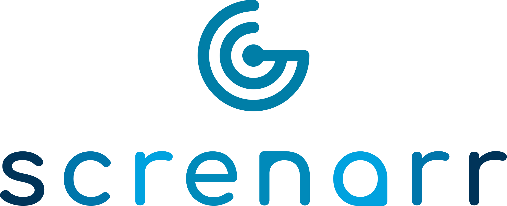
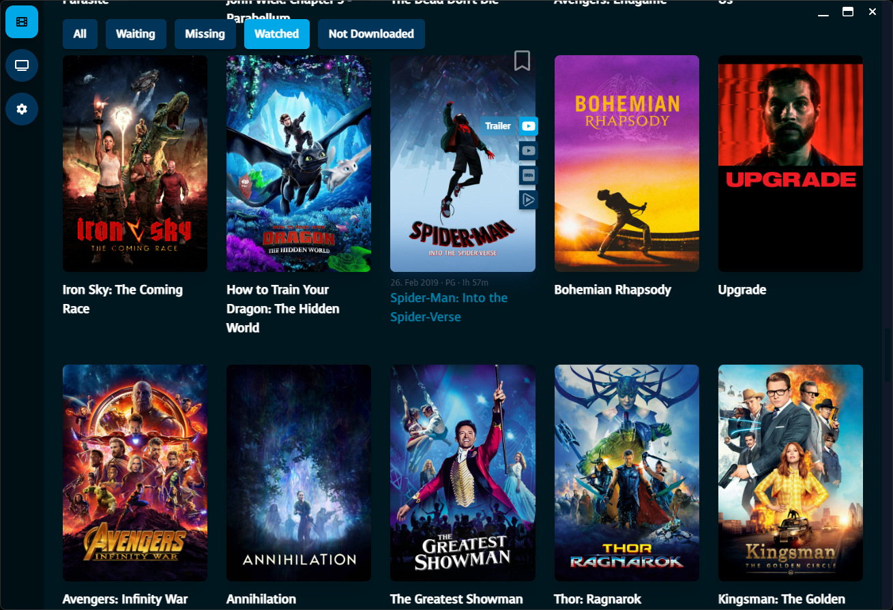
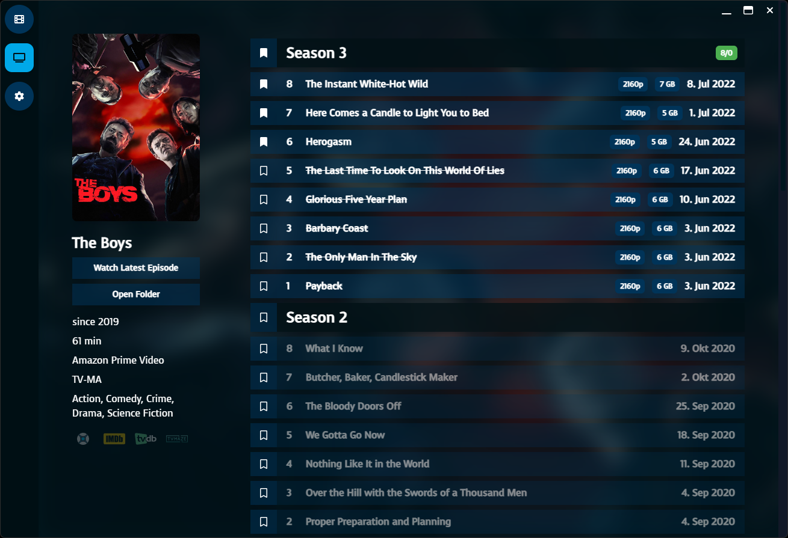

Screnarr is a media management tool for Sonarr and Radarr. 

I developed this tool to try out Electron and see how it works. 
It served and serves its intended purpose of being a simple and specialized media management tool for my use case.
There is currently no plan to further develop it.

## Screenshots

### Developed with
- Electron
- Mithril
- TailwindCSS